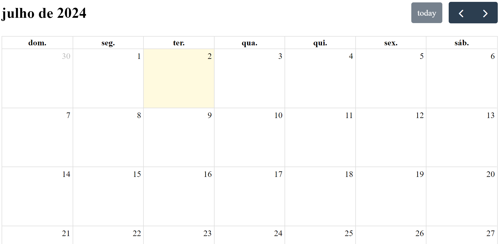

# Sistema de Agendamento

afaffsafsasdasASaddADSASASDASDAZ\Xsa

<br>
<br>

Este projeto é um sistema de agendamento utilizando Node.js, Express e FullCalendar. Permite criar, visualizar e gerenciar compromissos.

<div align="center">
  
</div>

## Sumário

- [Tecnologias Utilizadas](#tecnologias-utilizadas)
- [Status](#status)
- [Descrição](#descrição)
- [Funcionalidades](#funcionalidades)
- [Explicação](#explicação)
- [Como Usar](#como-usar)
- [Autor](#autor)

<br>
<br>

## Tecnologias Utilizadas

<div style="display: flex; flex-direction: row;">
  <div style="margin-right: 20px; display: flex; justify-content: flex-start;">
    
  </div>
  <div style="margin-right: 20px; display: flex; justify-content: flex-start;">
    
  </div>
  <div style="margin-right: 20px; display: flex; justify-content: flex-start;">
    
  </div>
  <div style="margin-right: 20px; display: flex; justify-content: flex-start;">
    
  </div>
</div>

<br>
<br>

## Status


<br>
<br>

## Descrição

Este projeto é um sistema de agendamento desenvolvido com Node.js e Express, integrado com o FullCalendar para visualização dos compromissos. Permite o cadastro, listagem, busca, e notificação de compromissos.

<br>
<br>

## Funcionalidades

- Cadastro de novos compromissos.
- Visualização de compromissos no calendário.
- Listagem e busca de compromissos.
- Envio de notificações para compromissos próximos.

<br>
<br>

## Explicação

O código é um sistema de agendamento desenvolvido com Node.js e Express, utilizando MongoDB para armazenamento de dados. Ele configura o servidor, define rotas para exibir páginas de cadastro, listar e buscar compromissos, além de criar, visualizar, concluir e notificar compromissos. A interface é gerada com EJS e os dados são manipulados através do serviço AppointmentService. As notificações são enviadas periodicamente a cada 5 minutos, e o servidor é iniciado na porta 3000.

<br>
<br>

### 1. Configuração Inicial

```javascript
const express = require("express");
const app = express();
const bodyParser = require("body-parser");
const mongoose = require("mongoose");
const appointmentService = require("./services/AppointmentService");
const AppointmentService = require("./services/AppointmentService");

app.use(express.static("public"));

app.use(bodyParser.urlencoded({ extended: false }));
app.use(bodyParser.json());

app.set("view engine", "ejs");
```

Nesta seção, configuramos o Express, definimos o uso do BodyParser para parsing de requisições e configuramos a engine de visualização EJS. Também importamos o serviço de agendamentos.

<br>
<br>

### 2. Conexão com o Banco de Dados

```javascript
mongoose.connect("mongodb://localhost:27017/agendamento", {
  useNewUrlParser: true,
  useUnifiedTopology: true,
});
mongoose.set("useFindAndModify", false);
```

Aqui, estabelecemos a conexão com o banco de dados MongoDB.

<br>
<br>

### 3. Rotas

#### Rota Principal

```javascript
app.get("/", (req, res) => {
  res.render("index");
});
```

Renderiza a página principal.

<br>

#### Rota de Cadastro

```javascript
app.get("/cadastro", (req, res) => {
  res.render("create");
});
```

<br>

#### Renderiza a página de cadastro.

Criação de Compromisso

```javascript
app.post("/create", async (req, res) => {
  var status = await appointmentService.Create(
    req.body.name,
    req.body.email,
    req.body.description,
    req.body.cpf,
    req.body.date,
    req.body.time
  );

  if (status) {
    res.redirect("/");
  } else {
    res.send("Ocorreu uma falha!");
  }
});
```

Processa a criação de um novo compromisso e redireciona para a página principal se bem-sucedido.

<br>

#### Obtenção de Compromissos

```javascript
app.get("/getcalendar", async (req, res) => {
  var appointments = await AppointmentService.GetAll(false);
  res.json(appointments);
});
```

Retorna todos os compromissos em formato JSON.

<br>

#### Visualização de Compromisso

```javascript
app.get("/event/:id", async (req, res) => {
  var appointment = await AppointmentService.GetById(req.params.id);
  console.log(appointment);
  res.render("event", { appo: appointment });
});
```

Renderiza a página de um compromisso específico.

<br>

#### Conclusão de Compromisso

```javascript
app.post("/finish", async (req, res) => {
  var id = req.body.id;
  var result = await AppointmentService.Finish(id);
  res.redirect("/");
});
```

Marca um compromisso como concluído.

<br>

#### Listagem de Compromissos

```javascript
app.get("/list", async (req, res) => {
  var appos = await AppointmentService.GetAll(true);
  res.render("list", { appos });
});
```

Renderiza a lista de compromissos.

<br>

#### Busca de Compromissos

```javascript
app.get("/searchresult", async (req, res) => {
  var appos = await AppointmentService.Search(req.query.search);
  res.render("list", { appos });
});
```

Busca compromissos por CPF ou nome.

<br>
<br>

### 4. Notificações

```javascript

var pollTime = 1000 _ 60 _ 5;
setInterval(async () => {
await AppointmentService.SendNotification();
}, pollTime);
```

#### Configura o envio de notificações a cada 5 minutos.

<br>
<br>

### 5. Início do Servidor

```javascript
app.listen(3000, () => {
  console.log("Servidor rodando!");
});
```

Inicia o servidor na porta 3000.

<br>
<br>

## Como Usar

`1.` Clone o repositório.

`2.`Instale as dependências com npm install.

`3.`Inicie o servidor com npm start.

<br>
<br>

## Estrutura do projeto

├── factories/

└── AppointmentFactory.js

├── services/

└── AppointmentService.js

├── models/

└── Appointment.js

├── public/

└── (arquivos estáticos como CSS, JS, imagens)

├── views/

└── index.ejs

└── create.ejs

└── event.ejs

└── list.ejs

└── index.js

<br>
<br>

# Autor

Desenvolvido por Diego Franco
